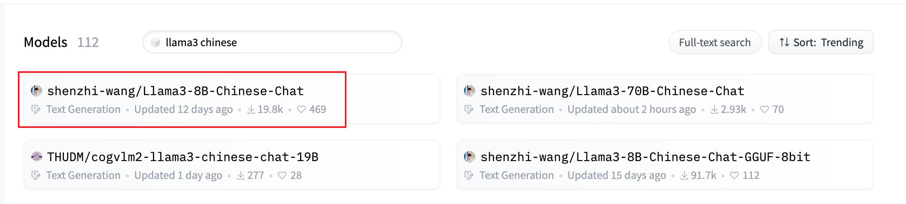

# 金融大模型分享

## 模型Finetune
1. 下载经过中文微调过的llama3  
https://huggingface.co/models?sort=trending&search=llama3+chinese

替代品 **modelscope**： https://modelscope.cn/search?search=llama3

## 模型量化

## 模型部署
- 使用ollama部署服务

## RAG

## autodl环境设置
1. 启用github/ huggingface代理  
`source /etc/network_turbo`

2. 停用代理  
`unset http_proxy && unset https_proxy`

3. 修改HF下载模型位置（可选）  
`export HF_HOME=/root/autodl-tmp/cache/`