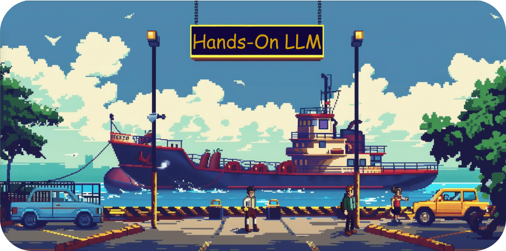

  

  ![GitHub stars][img_github_stars]
  ![GitHub forks][img_github_forks]
  ![GitHub watchers][img_github_watchers]
  ![GitHub repo size][img_github_size]
  ![GitHub language count][img_github_lang_count]
  ![GitHub top language][img_github_top_lang]
  ![GitHub last commit][img_github_last_commit]
  

# 📌 动手做大模型系列

如果你在实操的过程中遇到问题，请在对应的视频下方留言。
复现遇到bug，请描述：
1. 运行环境
2. 对应的代码、日志和报错截图

💬 如果你有好玩的想法，欢迎来找我聊聊：  
[![Feishu][img_feishu]][ref_feishu]

> 如果你不太了解如何提出一个好问题，请花几分钟阅读一下这个，相信我，可能并不能改变什么（不是）。  
> [How-To-Ask-Questions-The-Smart-Way][ref_how_to_ask]  

---

### 📑 快速导航
- [1. Agent 智能体系统](#-1-agent-智能体系统)
- [2. 大模型核心技术](#-2-大模型核心技术)
- [3. 动手加入开源](#-3-动手加入开源)
- [4. 模块知识专题系列](#-4-模块知识专题系列)
- [5. 不着调的 AI 项目](#-5-不着调的-ai-项目)
- [6. 番外篇](#-6-番外篇)

---

## 💡 1. Agent 智能体系统
> 探索 Agent 架构设计与系统落地，最新连载中...

| 序号 | 项目 | 代码文档 | 视频教程 | 时长 |
| :--- | :--- | :--- | :--- | :--- |
| 1 | Agent 服务架构设计 | [文档][ref_agent_1_doc] | [![bilibili][img_agent_1_bili]][ref_agent_1_bili] [![youtube][img_agent_1_yt]][ref_agent_1_yt] | <kbd><small>7:32</small></kbd> |

## 💡 2. 大模型核心技术
> 涵盖大模型微调、部署、RAG、工作流等核心实战。

| 序号 | 项目 | 代码文档 | 视频教程 | 时长 |
| :--- | :--- | :--- | :--- | :--- |
| 21 | fastmcp 实现mcp服务端和客户端 | [文档](#) | [![bilibili][img_llm_21_bili]][ref_llm_21_bili] [![youtube][img_llm_21_yt]][ref_llm_21_yt] | <kbd><small>26:01</small></kbd> |
| 20 | langfuse llm服务监控平台 | [文档][ref_llm_20_doc] | [![bilibili][img_llm_20_bili]][ref_llm_20_bili] [![youtube][img_llm_20_yt]][ref_llm_20_yt] | <kbd><small>26:15</small></kbd> |
| 19 | 构建高效RAG知识库 | [文档][ref_llm_19_doc] | [![bilibili][img_llm_19_bili]][ref_llm_19_bili] [![youtube][img_llm_19_yt]][ref_llm_19_yt] | <kbd><small>37:41</small></kbd> |

<b>点击展开查看往期 1~18 期内容</b>

| 序号 | 项目 | 代码文档 | 视频教程 | 时长 |
| :--- | :--- | :--- | :--- | :--- |
| 18 | milvus向量数据库 | [文档][ref_llm_18_doc] | [![bilibili][img_llm_18_bili]][ref_llm_18_bili] [![youtube][img_llm_18_yt]][ref_llm_18_yt] | <kbd><small>28:13</small></kbd> |
| 17 | tool-call原理及极简browser-use实现 | [文档][ref_llm_17_doc] | [![bilibili][img_llm_17_bili]][ref_llm_17_bili] [![youtube][img_llm_17_yt]][ref_llm_17_yt] | <kbd><small>14:47</small></kbd> |
| 16 | deepseek-r1模型微调和训练数据构造 | [文档][ref_llm_16_doc] | [![bilibili][img_llm_16_bili]][ref_llm_16_bili] [![youtube][img_llm_16_yt]][ref_llm_16_yt] | <kbd><small>14:01</small></kbd> |
| 15 | rpa自动化结合LLM workflow | [文档][ref_llm_15_doc] | [![bilibili][img_llm_15_bili]][ref_llm_15_bili] [![youtube][img_llm_15_yt]][ref_llm_15_yt] | <kbd><small>13:20</small></kbd> |
| 14 | dify实现Agent和LLM Workflow | [文档][ref_llm_14_doc] | [![bilibili][img_llm_14_bili]][ref_llm_14_bili] [![youtube][img_llm_14_yt]][ref_llm_14_yt] | <kbd><small>59:23</small></kbd> |
| 13 | AI算法项目开发流程及实例 | [文档][ref_llm_13_doc] | [![bilibili][img_llm_13_bili]][ref_llm_13_bili] [![youtube][img_llm_13_yt]][ref_llm_13_yt] | <kbd><small>34:43</small></kbd> |
| 12 | AI标注流程及label studio框架 | [文档][ref_llm_12_doc] | [![bilibili][img_llm_12_bili]][ref_llm_12_bili] [![youtube][img_llm_12_yt]][ref_llm_12_yt] | <kbd><small>20:00</small></kbd> |
| 11 | 大模型算法岗非技术答疑 | [文档][ref_llm_11_doc] | [![bilibili][img_llm_11_bili]][ref_llm_11_bili] [![youtube][img_llm_11_yt]][ref_llm_11_yt] | <kbd><small>16:00</small></kbd> |
| 10 | 大模型学习路径及面试 | [文档][ref_llm_10_doc] | [![bilibili][img_llm_10_bili]][ref_llm_10_bili] [![youtube][img_llm_10_yt]][ref_llm_10_yt] | <kbd><small>25:01</small></kbd> |
| 9 | function-calling 自动发邮件 | [文档][ref_llm_09_doc] | [![bilibili][img_llm_09_bili]][ref_llm_09_bili] [![youtube][img_llm_09_yt]][ref_llm_09_yt] | <kbd><small>23:10</small></kbd> |
| 8 | mkdocs+readthedocs部署项目文档 | [文档][ref_llm_08_doc] | [![bilibili][img_llm_08_bili]][ref_llm_08_bili] [![youtube][img_llm_08_yt]][ref_llm_08_yt] | <kbd><small>11:25</small></kbd> |
| 7 | graph-rag本地部署 | [文档][ref_llm_07_doc] | [![bilibili][img_llm_07_bili]][ref_llm_07_bili] [![youtube][img_llm_07_yt]][ref_llm_07_yt] | <kbd><small>23:23</small></kbd> |
| 6 | llama-index实现RAG | [文档][ref_llm_06_doc] | [![bilibili][img_llm_06_bili]][ref_llm_06_bili] [![youtube][img_llm_06_yt]][ref_llm_06_yt] | <kbd><small>21:48</small></kbd> |
| 5 | vllm部署工具及paged attention | [文档][ref_llm_05_doc] | [![bilibili][img_llm_05_bili]][ref_llm_05_bili] [![youtube][img_llm_05_yt]][ref_llm_05_yt] | <kbd><small>40:28</small></kbd> |
| 4 | ollama大模型部署工具介绍 | [文档][ref_llm_04_doc] | [![bilibili][img_llm_04_bili]][ref_llm_04_bili] [![youtube][img_llm_04_yt]][ref_llm_04_yt] | <kbd><small>21:28</small></kbd> |
| 3 | llama.cpp进行轻量化部署和量化 | [文档][ref_llm_03_doc] | [![bilibili][img_llm_03_bili]][ref_llm_03_bili] [![youtube][img_llm_03_yt]][ref_llm_03_yt] | <kbd><small>46:37</small></kbd> |
| 2 | 训练数据整理以及微调优化建议 | [文档][ref_llm_02_doc] | [![bilibili][img_llm_02_bili]][ref_llm_02_bili] [![youtube][img_llm_02_yt]][ref_llm_02_yt] | <kbd><small>20:13</small></kbd> |
| 1 | 使用llama-factory微调llama3 | [文档][ref_llm_01_doc] | [![bilibili][img_llm_01_bili]][ref_llm_01_bili] [![youtube][img_llm_01_yt]][ref_llm_01_yt] | <kbd><small>35:28</small></kbd> |

## 🛠️ 3. 动手加入开源
> 主要讲开源项目规范的一些内容。

| 序号 | 项目 | 代码文档 | 视频教程 | 时长 |
| :--- | :--- | :--- | :--- | :--- |
| 4 | 代码测试：pytest | [文档][ref_opensource_4_doc] | [![bilibili][img_opensource_4_bili]][ref_opensource_4_bili] [![youtube][img_opensource_4_yt]][ref_opensource_4_yt] | <kbd><small>11:21</small></kbd> |
| 3 | 代码提交检查：pre-commit | [文档][ref_opensource_3_doc] | [![bilibili][img_opensource_3_bili]][ref_opensource_3_bili] [![youtube][img_opensource_3_yt]][ref_opensource_3_yt] | <kbd><small>11:21</small></kbd> |
| 2 | python工程实践 · 代码规范：ruff | [文档][ref_opensource_2_doc] | [![bilibili][img_opensource_2_bili]][ref_opensource_2_bili] [![youtube][img_opensource_2_yt]][ref_opensource_2_yt] | <kbd><small>21:50</small></kbd> |
| 1 | python工程实践 · 依赖管理：uv | [文档][ref_opensource_1_doc] | [![bilibili][img_opensource_1_bili]][ref_opensource_1_bili] [![youtube][img_opensource_1_yt]][ref_opensource_1_yt] | <kbd><small>24:11</small></kbd> |

## 📦 4. 模块知识专题系列
> 专题系列会以多个视频介绍同一个主题，分P的形式展示，即共用一个视频链接。

| 序号 | 项目 | 代码文档 | 视频教程 | 时长 |
| :--- | :--- | :--- | :--- | :--- |
| 3 | docker 容器化部署（已完结）| [文档][ref_module_3_doc] | [![bilibili][img_module_3_bili]][ref_module_3_bili] [![youtube][img_module_3_yt]][ref_module_3_yt] | <kbd><small>62:59</small></kbd> |
| 2 | gradio 使用python构建并分享AI应用（已完结） | [文档][ref_module_2_doc] | [![bilibili][img_module_2_bili]][ref_module_2_bili] [![youtube][img_module_2_yt]][ref_module_2_yt] | <kbd><small>70:51</small></kbd> |
| 1 | kaggle 大模型竞赛系列（更新至01期） | [文档][ref_module_1_doc] | [![bilibili][img_module_1_bili]][ref_module_1_bili] [![youtube][img_module_1_yt]][ref_module_1_yt] | <kbd><small>25:41</small></kbd> |

## 🚀 5. 不着调的 AI 项目
> 将一些脑洞大开的点子落地成 AI 项目的不着调专题。

| 序号 | 项目 | 代码文档 | 视频教程 | 时长 |
| :--- | :--- | :--- | :--- | :--- |
| 3 | 猎空: LLM+微信自动化资讯机器人 | [tracer][ref_project_3_doc] | [![bilibili][img_project_3_bili]][ref_project_3_bili] [![youtube][img_project_3_yt]][ref_project_3_yt] | <kbd><small>15:11</small></kbd> |
| 2 | 听舒: 换声引擎-用作者的声音读自传 | [tingshu][ref_project_2_doc] | [![bilibili][img_project_2_bili]][ref_project_2_bili] [![youtube][img_project_2_yt]][ref_project_2_yt] | <kbd><small>4:16</small></kbd> |
| 1 | D.Va: 基于deepseek优化的端到端多人播客工具 | [d.va][ref_project_1_doc] | [![bilibili][img_project_1_bili]][ref_project_1_bili] [![youtube][img_project_1_yt]][ref_project_1_yt] | <kbd><small>13:42</small></kbd> |

## 🎈 6. 番外篇
> 懒得分类的技术合集。

| 序号 | 项目 | 代码文档 | 视频教程 | 时长 |
| :--- | :--- | :--- | :--- | :--- |
| 1 | B站实现动态转发抽奖 | [文档][ref_extra_1_doc] | [![bilibili][img_extra_1_bili]][ref_extra_1_bili] [![youtube][img_extra_1_yt]][ref_extra_1_yt] | <kbd><small>4:40</small></kbd> |

---

<!-- 底部链接引用区，使源码保持整洁 -->

<!-- GitHub 徽章 -->
[img_github_stars]: https://img.shields.io/github/stars/echonoshy/cgft-llm?style=social
[img_github_forks]: https://img.shields.io/github/forks/echonoshy/cgft-llm?style=social
[img_github_watchers]: https://img.shields.io/github/watchers/echonoshy/cgft-llm?style=social
[img_github_size]: https://img.shields.io/github/repo-size/echonoshy/cgft-llm
[img_github_lang_count]: https://img.shields.io/github/languages/count/echonoshy/cgft-llm
[img_github_top_lang]: https://img.shields.io/github/languages/top/echonoshy/cgft-llm
[img_github_last_commit]: https://img.shields.io/github/last-commit/echonoshy/cgft-llm?color=red

<!-- 通用链接 -->
[img_feishu]: https://img.shields.io/badge/%E9%A3%9E%E4%B9%A6-%E9%AD%94%E7%8E%8B%E5%A4%A7%E4%BA%BA%E7%94%B3%E8%AF%B7%E6%B7%BB%E5%8A%A0%E4%BD%A0%E4%B8%BA%E8%81%94%E7%B3%BB%E4%BA%BA-00D6B9?style=flat-square
[ref_feishu]: https://www.feishu.cn/invitation/page/add_contact/?token=7c0pc01a-60b9-4c7e-bcc4-ed5a2cab4625
[ref_how_to_ask]: https://github.com/ryanhanwu/How-To-Ask-Questions-The-Smart-Way/blob/main/README-zh_CN.md

<!-- Agent 智能体系统 -->
[img_agent_1_bili]: https://img.shields.io/badge/dynamic/json?label=B%E7%AB%99&style=social&logo=bilibili&query=data.stat.view&url=https%3A%2F%2Fapi.bilibili.com%2Fx%2Fweb-interface%2Fview%3Fbvid%3DBV1A8DeBbE5f
[img_agent_1_yt]: https://img.shields.io/youtube/views/WkAFAzAKM1s?style=social
[ref_agent_1_doc]: 01-agent-sys/agent-service-architecture.html
[ref_agent_1_bili]: https://www.bilibili.com/video/BV1A8DeBbE5f
[ref_agent_1_yt]: https://youtu.be/WkAFAzAKM1s

<!-- 大模型核心技术 -->
[img_llm_21_bili]: https://img.shields.io/badge/dynamic/json?label=B%E7%AB%99&style=social&logo=bilibili&query=data.stat.view&url=https%3A%2F%2Fapi.bilibili.com%2Fx%2Fweb-interface%2Fview%3Fbvid%3DBV1rE1SBpEha
[img_llm_21_yt]: https://img.shields.io/youtube/views/6vY0aJITFb4?style=social
[ref_llm_21_bili]: https://www.bilibili.com/video/BV1rE1SBpEha
[ref_llm_21_yt]: https://youtu.be/6vY0aJITFb4

[img_llm_20_bili]: https://img.shields.io/badge/dynamic/json?label=B%E7%AB%99&style=social&logo=bilibili&query=data.stat.view&url=https%3A%2F%2Fapi.bilibili.com%2Fx%2Fweb-interface%2Fview%3Fbvid%3DBV1tUpDzwEr3
[img_llm_20_yt]: https://img.shields.io/youtube/views/nswdes0AlFY?style=social
[ref_llm_20_doc]: 02-llm-core/docs/langfuse.md
[ref_llm_20_bili]: https://www.bilibili.com/video/BV1tUpDzwEr3
[ref_llm_20_yt]: https://youtu.be/nswdes0AlFY

[img_llm_19_bili]: https://img.shields.io/badge/dynamic/json?label=B%E7%AB%99&style=social&logo=bilibili&query=data.stat.view&url=https%3A%2F%2Fapi.bilibili.com%2Fx%2Fweb-interface%2Fview%3Fbvid%3DBV1HTdkYeExC
[img_llm_19_yt]: https://img.shields.io/youtube/views/zI0D4BUeRcE?style=social
[ref_llm_19_doc]: 02-llm-core/rag-knowledge-base/readme.md
[ref_llm_19_bili]: https://www.bilibili.com/video/BV1HTdkYeExC
[ref_llm_19_yt]: https://youtu.be/zI0D4BUeRcE

[img_llm_18_bili]: https://img.shields.io/badge/dynamic/json?label=B%E7%AB%99&style=social&logo=bilibili&query=data.stat.view&url=https%3A%2F%2Fapi.bilibili.com%2Fx%2Fweb-interface%2Fview%3Fbvid%3DBV1T9ZhYnEWW
[img_llm_18_yt]: https://img.shields.io/youtube/views/-qGUeOJJ2eM?style=social
[ref_llm_18_doc]: 02-llm-core/milvus/readme.md
[ref_llm_18_bili]: https://www.bilibili.com/video/BV1T9ZhYnEWW
[ref_llm_18_yt]: https://youtu.be/-qGUeOJJ2eM

[img_llm_17_bili]: https://img.shields.io/badge/dynamic/json?label=B%E7%AB%99&style=social&logo=bilibili&query=data.stat.view&url=https%3A%2F%2Fapi.bilibili.com%2Fx%2Fweb-interface%2Fview%3Fbvid%3DBV1yUQhYwEJ2
[img_llm_17_yt]: https://img.shields.io/youtube/views/m9GoJVEp-1w?style=social
[ref_llm_17_doc]: 02-llm-core/tool-calls/readme.md
[ref_llm_17_bili]: https://www.bilibili.com/video/BV1yUQhYwEJ2
[ref_llm_17_yt]: https://youtu.be/m9GoJVEp-1w

[img_llm_16_bili]: https://img.shields.io/badge/dynamic/json?label=B%E7%AB%99&style=social&logo=bilibili&query=data.stat.view&url=https%3A%2F%2Fapi.bilibili.com%2Fx%2Fweb-interface%2Fview%3Fbvid%3DBV1sR9fYUE8z
[img_llm_16_yt]: https://img.shields.io/youtube/views/FNuEnwrMbas?style=social
[ref_llm_16_doc]: 02-llm-core/docs/deepseek-r1-finetune.md
[ref_llm_16_bili]: https://www.bilibili.com/video/BV1sR9fYUE8z
[ref_llm_16_yt]: https://youtu.be/FNuEnwrMbas

[img_llm_15_bili]: https://img.shields.io/badge/dynamic/json?label=B%E7%AB%99&style=social&logo=bilibili&query=data.stat.view&url=https%3A%2F%2Fapi.bilibili.com%2Fx%2Fweb-interface%2Fview%3Fbvid%3DBV1qcNUeNEXf
[img_llm_15_yt]: https://img.shields.io/youtube/views/Y7b0RVVO6QI?style=social
[ref_llm_15_doc]: 02-llm-core/docs/rpa-automation-with-llm-agent.md
[ref_llm_15_bili]: https://www.bilibili.com/video/BV1qcNUeNEXf
[ref_llm_15_yt]: https://youtu.be/Y7b0RVVO6QI

[img_llm_14_bili]: https://img.shields.io/badge/dynamic/json?label=B%E7%AB%99&style=social&logo=bilibili&query=data.stat.view&url=https%3A%2F%2Fapi.bilibili.com%2Fx%2Fweb-interface%2Fview%3Fbvid%3DBV1hacaeNEQJ
[img_llm_14_yt]: https://img.shields.io/youtube/views/zU5nHsUx5ck?style=social
[ref_llm_14_doc]: 02-llm-core/docs/dify-agent-llm-workflow.md
[ref_llm_14_bili]: https://www.bilibili.com/video/BV1hacaeNEQJ
[ref_llm_14_yt]: https://youtu.be/zU5nHsUx5ck

[img_llm_13_bili]: https://img.shields.io/badge/dynamic/json?label=B%E7%AB%99&style=social&logo=bilibili&query=data.stat.view&url=https%3A%2F%2Fapi.bilibili.com%2Fx%2Fweb-interface%2Fview%3Fbvid%3DBV1XSUpYmERX
[img_llm_13_yt]: https://img.shields.io/youtube/views/dB9t3fcuVF8?style=social
[ref_llm_13_doc]: 02-llm-core/docs/AI项目开发流程.pdf
[ref_llm_13_bili]: https://www.bilibili.com/video/BV1XSUpYmERX
[ref_llm_13_yt]: https://youtu.be/dB9t3fcuVF8

[img_llm_12_bili]: https://img.shields.io/badge/dynamic/json?label=B%E7%AB%99&style=social&logo=bilibili&query=data.stat.view&url=https%3A%2F%2Fapi.bilibili.com%2Fx%2Fweb-interface%2Fview%3Fbvid%3DBV1oRxteFEJi
[img_llm_12_yt]: https://img.shields.io/youtube/views/rTNrfq5Ay7o?style=social
[ref_llm_12_doc]: 02-llm-core/docs/label-studio.md
[ref_llm_12_bili]: https://www.bilibili.com/video/BV1oRxteFEJi
[ref_llm_12_yt]: https://youtu.be/rTNrfq5Ay7o

[img_llm_11_bili]: https://img.shields.io/badge/dynamic/json?label=B%E7%AB%99&style=social&logo=bilibili&query=data.stat.view&url=https%3A%2F%2Fapi.bilibili.com%2Fx%2Fweb-interface%2Fview%3Fbvid%3DBV1Kjx7ejE5M
[img_llm_11_yt]: https://img.shields.io/youtube/views/JrY8CL0pz68?style=social
[ref_llm_11_doc]: 02-llm-core/docs/llm-no-tec-qa.md
[ref_llm_11_bili]: https://www.bilibili.com/video/BV1Kjx7ejE5M/
[ref_llm_11_yt]: https://youtu.be/JrY8CL0pz68

<!-- 大模型核心技术 10-01 -->
[img_llm_10_bili]: https://img.shields.io/badge/dynamic/json?label=B%E7%AB%99&style=social&logo=bilibili&query=data.stat.view&url=https%3A%2F%2Fapi.bilibili.com%2Fx%2Fweb-interface%2Fview%3Fbvid%3DBV1maW4euELX
[img_llm_10_yt]: https://img.shields.io/youtube/views/-YLeUO6wwz8?style=social
[ref_llm_10_doc]: 02-llm-core/docs/llm-roadmap.md
[ref_llm_10_bili]: https://www.bilibili.com/video/BV1maW4euELX
[ref_llm_10_yt]: https://youtu.be/-YLeUO6wwz8

[img_llm_09_bili]: https://img.shields.io/badge/dynamic/json?label=B%E7%AB%99&style=social&logo=bilibili&query=data.stat.view&url=https%3A%2F%2Fapi.bilibili.com%2Fx%2Fweb-interface%2Fview%3Fbvid%3DBV1eH4y1c7KQ
[img_llm_09_yt]: https://img.shields.io/youtube/views/U2tbBxtA_wQ?style=social
[ref_llm_09_doc]: 02-llm-core/function-calling/README.md
[ref_llm_09_bili]: https://www.bilibili.com/video/BV1eH4y1c7KQ/
[ref_llm_09_yt]: https://youtu.be/U2tbBxtA_wQ

[img_llm_08_bili]: https://img.shields.io/badge/dynamic/json?label=B%E7%AB%99&style=social&logo=bilibili&query=data.stat.view&url=https%3A%2F%2Fapi.bilibili.com%2Fx%2Fweb-interface%2Fview%3Fbvid%3DBV19f421v7P9
[img_llm_08_yt]: https://img.shields.io/youtube/views/FRyvV-hj65M?style=social
[ref_llm_08_doc]: 02-llm-core/docs/mkdocs.md
[ref_llm_08_bili]: https://www.bilibili.com/video/BV19f421v7P9
[ref_llm_08_yt]: https://youtu.be/FRyvV-hj65M

[img_llm_07_bili]: https://img.shields.io/badge/dynamic/json?label=B%E7%AB%99&style=social&logo=bilibili&query=data.stat.view&url=https%3A%2F%2Fapi.bilibili.com%2Fx%2Fweb-interface%2Fview%3Fbvid%3DBV1rE421w7t3
[img_llm_07_yt]: https://img.shields.io/youtube/views/tFLJUXsKGsc?style=social
[ref_llm_07_doc]: 02-llm-core/graph-rag/README.md
[ref_llm_07_bili]: https://www.bilibili.com/video/BV1rE421w7t3
[ref_llm_07_yt]: https://youtu.be/tFLJUXsKGsc

[img_llm_06_bili]: https://img.shields.io/badge/dynamic/json?label=B%E7%AB%99&style=social&logo=bilibili&query=data.stat.view&url=https%3A%2F%2Fapi.bilibili.com%2Fx%2Fweb-interface%2Fview%3Fbvid%3DBV1jE421A77u
[img_llm_06_yt]: https://img.shields.io/youtube/views/Q6vUx94HCDc?style=social
[ref_llm_06_doc]: 02-llm-core/llama-index/README.md
[ref_llm_06_bili]: https://www.bilibili.com/video/BV1jE421A77u
[ref_llm_06_yt]: https://youtu.be/Q6vUx94HCDc

[img_llm_05_bili]: https://img.shields.io/badge/dynamic/json?label=B%E7%AB%99&style=social&logo=bilibili&query=data.stat.view&url=https%3A%2F%2Fapi.bilibili.com%2Fx%2Fweb-interface%2Fview%3Fbvid%3DBV1R1421r7tk
[img_llm_05_yt]: https://img.shields.io/youtube/views/cQWzKX9gM9Q?style=social
[ref_llm_05_doc]: 02-llm-core/vllm/README.md
[ref_llm_05_bili]: https://www.bilibili.com/video/BV1R1421r7tk
[ref_llm_05_yt]: https://youtu.be/cQWzKX9gM9Q

[img_llm_04_bili]: https://img.shields.io/badge/dynamic/json?label=B%E7%AB%99&style=social&logo=bilibili&query=data.stat.view&url=https%3A%2F%2Fapi.bilibili.com%2Fx%2Fweb-interface%2Fview%3Fbvid%3DBV1Gs421u7a5
[img_llm_04_yt]: https://img.shields.io/youtube/views/yQ1q8YWacyE?style=social
[ref_llm_04_doc]: 02-llm-core/docs/ollama-introduction.md
[ref_llm_04_bili]: https://www.bilibili.com/video/BV1Gs421u7a5/
[ref_llm_04_yt]: https://youtu.be/yQ1q8YWacyE

[img_llm_03_bili]: https://img.shields.io/badge/dynamic/json?label=B%E7%AB%99&style=social&logo=bilibili&query=data.stat.view&url=https%3A%2F%2Fapi.bilibili.com%2Fx%2Fweb-interface%2Fview%3Fbvid%3DBV1et421N7TK
[img_llm_03_yt]: https://img.shields.io/youtube/views/2MYsfe0pc9A?style=social
[ref_llm_03_doc]: 02-llm-core/llama-cpp/README.md
[ref_llm_03_bili]: https://www.bilibili.com/video/BV1et421N7TK
[ref_llm_03_yt]: https://youtu.be/2MYsfe0pc9A

[img_llm_02_bili]: https://img.shields.io/badge/dynamic/json?label=B%E7%AB%99&style=social&logo=bilibili&query=data.stat.view&url=https%3A%2F%2Fapi.bilibili.com%2Fx%2Fweb-interface%2Fview%3Fbvid%3DBV1vrksYgEP9
[img_llm_02_yt]: https://img.shields.io/youtube/views/tOVG1YZ9bcI?style=social
[ref_llm_02_doc]: 02-llm-core/docs/llama-factory-training-dataset.md
[ref_llm_02_bili]: https://www.bilibili.com/video/BV1vrksYgEP9
[ref_llm_02_yt]: https://youtu.be/tOVG1YZ9bcI

[img_llm_01_bili]: https://img.shields.io/badge/dynamic/json?label=B%E7%AB%99&style=social&logo=bilibili&query=data.stat.view&url=https%3A%2F%2Fapi.bilibili.com%2Fx%2Fweb-interface%2Fview%3Fbvid%3DBV1uw4m1S7Cd
[img_llm_01_yt]: https://img.shields.io/youtube/views/Hpc4QQQuLWM?style=social
[ref_llm_01_doc]: 02-llm-core/llama-factory/README.md
[ref_llm_01_bili]: https://www.bilibili.com/video/BV1uw4m1S7Cd/
[ref_llm_01_yt]: https://youtu.be/Hpc4QQQuLWM

<!-- 动手加入开源 -->
[img_opensource_4_bili]: https://img.shields.io/badge/dynamic/json?label=B%E7%AB%99&style=social&logo=bilibili&query=data.stat.view&url=https%3A%2F%2Fapi.bilibili.com%2Fx%2Fweb-interface%2Fview%3Fbvid%3DBV1xZU7B7E1t
[img_opensource_4_yt]: https://img.shields.io/youtube/views/AlVjS2VSVFI?style=social
[ref_opensource_4_doc]: 03-open-source/docs/pytest.md
[ref_opensource_4_bili]: https://www.bilibili.com/video/BV1xZU7B7E1t
[ref_opensource_4_yt]: https://youtu.be/AlVjS2VSVFI

[img_opensource_3_bili]: https://img.shields.io/badge/dynamic/json?label=B%E7%AB%99&style=social&logo=bilibili&query=data.stat.view&url=https%3A%2F%2Fapi.bilibili.com%2Fx%2Fweb-interface%2Fview%3Fbvid%3DBV1P5nfz6EKb
[img_opensource_3_yt]: https://img.shields.io/youtube/views/DtSHvJmM4Lo?style=social
[ref_opensource_3_doc]: 03-open-source/docs/pre-commit.md
[ref_opensource_3_bili]: https://www.bilibili.com/video/BV1P5nfz6EKb
[ref_opensource_3_yt]: https://youtu.be/DtSHvJmM4Lo

[img_opensource_2_bili]: https://img.shields.io/badge/dynamic/json?label=B%E7%AB%99&style=social&logo=bilibili&query=data.stat.view&url=https%3A%2F%2Fapi.bilibili.com%2Fx%2Fweb-interface%2Fview%3Fbvid%3DBV1zwpLz2Exh
[img_opensource_2_yt]: https://img.shields.io/youtube/views/fm-zgDFAqNY?style=social
[ref_opensource_2_doc]: 03-open-source/docs/ruff.md
[ref_opensource_2_bili]: https://www.bilibili.com/video/BV1zwpLz2Exh
[ref_opensource_2_yt]: https://youtu.be/fm-zgDFAqNY

[img_opensource_1_bili]: https://img.shields.io/badge/dynamic/json?label=B%E7%AB%99&style=social&logo=bilibili&query=data.stat.view&url=https%3A%2F%2Fapi.bilibili.com%2Fx%2Fweb-interface%2Fview%3Fbvid%3DBV179YKzjEx6
[img_opensource_1_yt]: https://img.shields.io/youtube/views/RJbxIaVFGSM?style=social
[ref_opensource_1_doc]: 03-open-source/docs/uv.md
[ref_opensource_1_bili]: https://www.bilibili.com/video/BV179YKzjEx6
[ref_opensource_1_yt]: https://youtu.be/RJbxIaVFGSM

<!-- 模块知识专题系列 -->
[img_module_3_bili]: https://img.shields.io/badge/dynamic/json?label=B%E7%AB%99&style=social&logo=bilibili&query=data.stat.view&url=https%3A%2F%2Fapi.bilibili.com%2Fx%2Fweb-interface%2Fview%3Fbvid%3DBV1o7y7Y8EZ1
[img_module_3_yt]: https://img.shields.io/youtube/views/DeYNR47abG8?style=social
[ref_module_3_doc]: 04-module-specials/docker/README.md
[ref_module_3_bili]: https://www.bilibili.com/video/BV1o7y7Y8EZ1/
[ref_module_3_yt]: https://youtu.be/DeYNR47abG8

[img_module_2_bili]: https://img.shields.io/badge/dynamic/json?label=B%E7%AB%99&style=social&logo=bilibili&query=data.stat.view&url=https%3A%2F%2Fapi.bilibili.com%2Fx%2Fweb-interface%2Fview%3Fbvid%3DBV1TK66YYEvJ
[img_module_2_yt]: https://img.shields.io/youtube/views/sRW_Q0Wzzwo?style=social
[ref_module_2_doc]: 04-module-specials/gradio/README.md
[ref_module_2_bili]: https://www.bilibili.com/video/BV1TK66YYEvJ/
[ref_module_2_yt]: https://youtu.be/sRW_Q0Wzzwo

[img_module_1_bili]: https://img.shields.io/badge/dynamic/json?label=B%E7%AB%99&style=social&logo=bilibili&query=data.stat.view&url=https%3A%2F%2Fapi.bilibili.com%2Fx%2Fweb-interface%2Fview%3Fbvid%3DBV1vVayeREVe
[img_module_1_yt]: https://img.shields.io/youtube/views/Mz4V3zinMYI?style=social
[ref_module_1_doc]: 04-module-specials/kaggle/getting-started.ipynb
[ref_module_1_bili]: https://www.bilibili.com/video/BV1vVayeREVe/
[ref_module_1_yt]: https://youtu.be/Mz4V3zinMYI

<!-- 不着调的 AI 项目 -->
[img_project_3_bili]: https://img.shields.io/badge/dynamic/json?label=B%E7%AB%99&style=social&logo=bilibili&query=data.stat.view&url=https%3A%2F%2Fapi.bilibili.com%2Fx%2Fweb-interface%2Fview%3Fbvid%3DBV15GXQY3Ez3
[img_project_3_yt]: https://img.shields.io/youtube/views/GQqbYRp5GYI?style=social
[ref_project_3_doc]: https://github.com/echonoshy/tracer
[ref_project_3_bili]: https://www.bilibili.com/video/BV15GXQY3Ez3/
[ref_project_3_yt]: https://youtu.be/GQqbYRp5GYI

[img_project_2_bili]: https://img.shields.io/badge/dynamic/json?label=B%E7%AB%99&style=social&logo=bilibili&query=data.stat.view&url=https%3A%2F%2Fapi.bilibili.com%2Fx%2Fweb-interface%2Fview%3Fbvid%3DBV1gYzEYrEQt
[img_project_2_yt]: https://img.shields.io/youtube/views/TdCrbDvICbw?style=social
[ref_project_2_doc]: https://github.com/echonoshy/tingshu
[ref_project_2_bili]: https://www.bilibili.com/video/BV1gYzEYrEQt/
[ref_project_2_yt]: https://youtu.be/TdCrbDvICbw

[img_project_1_bili]: https://img.shields.io/badge/dynamic/json?label=B%E7%AB%99&style=social&logo=bilibili&query=data.stat.view&url=https%3A%2F%2Fapi.bilibili.com%2Fx%2Fweb-interface%2Fview%3Fbvid%3DBV1miAYeMEqg
[img_project_1_yt]: https://img.shields.io/youtube/views/XjpNdvl-vvY?style=social
[ref_project_1_doc]: https://github.com/echonoshy/d.va
[ref_project_1_bili]: https://www.bilibili.com/video/BV1gYzEYrEQt/
[ref_project_1_yt]: https://youtu.be/XjpNdvl-vvY

<!-- 番外篇 -->
[img_extra_1_bili]: https://img.shields.io/badge/dynamic/json?label=B%E7%AB%99&style=social&logo=bilibili&query=data.stat.view&url=https%3A%2F%2Fapi.bilibili.com%2Fx%2Fweb-interface%2Fview%3Fbvid%3DBV1zdDpYhEqj
[img_extra_1_yt]: https://img.shields.io/youtube/views/Bnb92NG30us?style=social
[ref_extra_1_doc]: 06-extras/bilibili-lottery/bilibili_lottery.md
[ref_extra_1_bili]: https://www.bilibili.com/video/BV1zdDpYhEqj/
[ref_extra_1_yt]: https://youtu.be/Bnb92NG30us
